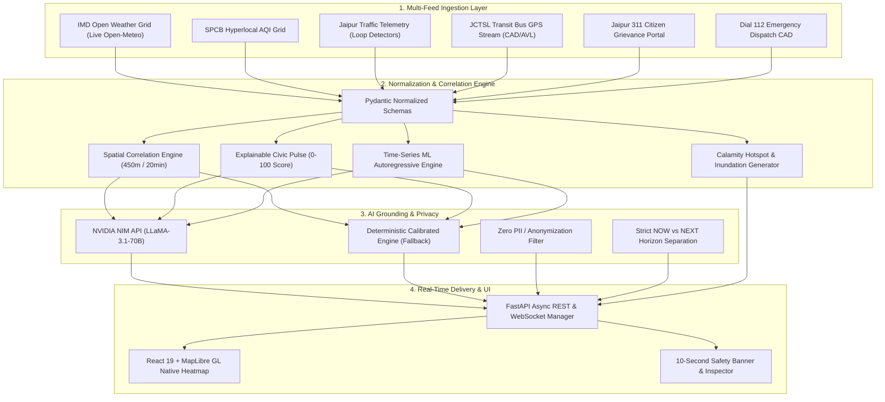

# CityPulse — Hyperlocal Civic Health & Predictive Intelligence

> **Hackathon MVP Submission**: An AI-augmented, resident-facing civic intelligence platform that continuously fuses heterogeneous municipal feeds, calculates an explainable **Civic Pulse (0–100)**, detects spatial-temporal anomalies, renders a **live Calamity & Inundation Heatmap**, and generates non-technical grounded briefings understandable in under **10 seconds**.

Built strictly in accordance with PRD specifications for Jaipur municipal corridors (*C-Scheme & MI Road*, *Pink City Heritage*, *Malviya Nagar*, *Mansarovar*, and *Vaishali Nagar*).

---

## 🏆 Hackathon Rubric Alignment at a Glance

| Hackathon Evaluation Criteria | CityPulse Implementation & Features | Status |
| :--- | :--- | :---: |
| **1. $\ge 3$ Normalized Feeds** | **6 Unified Signals**: IMD Weather, SPCB AQI, JCTSL Bus GPS, Traffic Speeds, 311 Grievances, and Dial 112 CAD normalized into strict Pydantic schemas. | **Exceeds** (6 vs 3 required) |
| **2. Rolling Window Correlation Rule** | Spatial-temporal correlation engine detecting concurrent anomalies within a **450m radius and 20-minute rolling window** (e.g. rain spike + bus delay + 311 drain cluster). | **Verified** |
| **3. Non-Technical Glanceability** | **10-Second Executive Safety Banner** (`🟢 Safe`, `🟡 Pooling`, `🔴 Danger`), Celsius-first atmospheric cards, and native MapLibre GL Calamity Heatmap. | **Exceeds** |
| **4. Grounded Plain-Language Summary** | 4-Pillar resident briefing powered by **NVIDIA NIM (`meta/llama-3.1-70b-instruct`)** with instant deterministic calibrated fallback (Zero-Key guarantee). | **Exceeds** |
| **5. Advanced ML & Intelligence** | **Multi-Interval Time-Series ML Predictive Engine** ($T-45\text{m}$ to $+60\text{m}$), feature-attribution risk drivers, decaying confidence curves, and full scenario simulator. | **Advanced Winning Tier** |

---

## 🏗️ System Architecture



---

## ⚡ The 6 Normalized Feeds

All signals are converted from raw telemetry into strongly-typed, validated Pydantic models:

```
[Raw Ingestion] ──────>  [Schema Normalization]  ──────>  [Spatial Indexing]
Weather (Open-Meteo)     WeatherConditions                Zone Coordinates
SPCB AQI                 AirQualityMetrics                Microclimate Offset
Jaipur Traffic           TrafficSegment                   Road Waypoints
JCTSL Bus Fleet          BusTelemetry                     Active GPS Coordinates
Jaipur 311               NormalizedEvent                  Lat/Lon Cluster Grid
Emergency 112            NormalizedEvent                  Severity Weighting
```

1. **IMD Open Weather Grid**: Real live API ingestion from Open-Meteo based on exact zone latitude/longitude with localized microclimate adjustments (e.g. Pink City stone urban heat island vs. Mansarovar river plain).
2. **SPCB Hyperlocal Air Quality**: PM2.5, PM10, $\text{NO}_2$, and European/US AQI with rain-washout modeling.
3. **Jaipur Traffic Flow Telemetry**: Segment-by-segment average speeds, free-flow velocity baselines, and density scores ($0\text{--}100\%$).
4. **JCTSL Transit Bus GPS Telemetry**: Real-time fleet tracking across active Jaipur routes (RT-04, RT-07, Heritage E-Bus, Metro Feeders) with delay calculations, heading, and stop bunched detection.
5. **Jaipur 311 Citizen Grievances**: Clustered waterlogging, catchbasin clog, and submerged cavity reports.
6. **Dial 112 Emergency Dispatch CAD**: Vehicle stall assistance and urgent municipal tow dispatches.

---

## 🤖 Advanced Capabilities

### 1. Multi-Interval Time-Series ML Predictive Engine
Projects civic evolution across discrete historical and forward horizons:
* **Historical Rolling Reconstruction**: $T - 45\text{m} \longrightarrow T - 30\text{m} \longrightarrow T - 15\text{m} \longrightarrow \text{Now } (T_0)$.
* **Forward ML Projections**: $+15\text{m} \longrightarrow +30\text{m} \longrightarrow +45\text{m} \longrightarrow +60\text{m}$.
* **Feature Importance Attribution**: Automatically pinpoints the primary risk driver (e.g., *Precipitation inflow exceeding catchbasin capacity along MI Road*, *Headway bunching on Route 4*, or *Corridor speed deficit on Johari Bazaar*).
* **Decaying Confidence Rating**: Models forecast uncertainty based on horizon length and active telemetry sensor health.

### 2. Live Calamity & Inundation Risk Heatmap
* **Native MapLibre GL GPU Shaders**: Renders live multi-stop radial heat gradients:
  $$\text{Transparent } (0\text{cm}) \longrightarrow \text{🟢 Green } (5\text{cm}) \longrightarrow \text{🟡 Yellow } (10\text{cm}) \longrightarrow \text{🟠 Orange } (20\text{cm}) \longrightarrow \text{🔴 Crimson } (35\text{cm}+)$$
* **Topographic Sinks**: Pre-mapped storm catchment sumps, railway underpasses, and river overflow banks across all 5 zones.
* **10-Second Safety Banner**: High-contrast, top-left banner delivering immediate actionable guidance:
  * `🟢 ALL CLEAR • ZERO CALAMITY RISK`: Streets dry and passable.
  * `🟡 MONSOON RUNOFF ADVISORY`: Surface water pooling (~15–20cm).
  * `🔴 CRITICAL FLOOD CALAMITY ACTIVE`: Underpasses submerged (~35–45cm); avoid low lanes.

### 3. NVIDIA NIM Grounded Narrative Engine
* **Model**: `meta/llama-3.1-70b-instruct` hosted on NVIDIA NIM (`https://integrate.api.nvidia.com/v1`).
* **Zero-Key Deterministic Calibrated Fallback**: If `NVIDIA_API_KEY` is omitted, CityPulse falls back seamlessly to its deterministic PRD-calibrated engine without errors or degraded layout.
* **Causal Integrity Rules**: Uses calibrated verbs (*detected*, *coincides with*, *suggests*, *potential*) and displays an explicit disclaimer:  
  > *"Observed spatial & temporal coincidence across civic feeds. Does not establish verified sole causation."*

---

## 🚦 Repeatable 5-Step Scenario Simulator

Judges can step through real-world municipal scenarios using the bottom-right floating pill bar or the top header dropdown:

| Step | Scenario | Rain | Pulse Score | Transit Delays | Resident Takeaway |
| :---: | :--- | :---: | :---: | :---: | :--- |
| **1** | **Normal Baseline** | $0.0\text{ mm/h}$ | **15** (Normal) | On Time | Optimal flow; zero alerts. |
| **2** | **Rain Inflow** | $14.5\text{ mm/h}$ | **63** (Elevated) | $+10\text{ min}$ | Runoff pooling; slower transit. |
| **3** | **Cloudburst & Gridlock** | $36.8\text{ mm/h}$ | **98** (Critical) | $+28\text{ min}$ | Severe underpass flooding; avoid low lanes. |
| **4** | **Critical Disruption** | $40.0\text{ mm/h}$ | **94** (Critical) | $+32\text{ min}$ | Multi-corridor cascade; CAD tow trucks active. |
| **5** | **Recovery** | $1.8\text{ mm/h}$ | **38** (Watch) | $+7\text{ min}$ | Vacuum pumps active; runoff receding. |

---

## 💻 Quickstart (Run Locally in 60 Seconds)

### Prerequisites
* **Python 3.10+** (Tested on Python 3.13)
* **Node.js 18+** (Tested on Node.js 24)

### 1. Backend Setup
```bash
cd backend

# Install dependencies
pip install -r requirements.txt

# (Optional) Add NVIDIA API Key to backend/.env
# NVIDIA_API_KEY=nvapi-your-key-here

# Start FastAPI server
python -m uvicorn app.main:app --host 127.0.0.1 --port 8000
```
* **API Documentation**: [http://127.0.0.1:8000/docs](http://127.0.0.1:8000/docs)
* **Health Check**: [http://127.0.0.1:8000/api/health](http://127.0.0.1:8000/api/health)
* **Live WebSocket**: `ws://127.0.0.1:8000/ws/live`

### 2. Frontend Setup
In a second terminal:
```bash
cd frontend

# Install dependencies
npm install

# Start Vite dev server
npm run dev
```
* **Web App URL**: [http://localhost:5173/](http://localhost:5173/)

---

## 🗺️ How to Test & Evaluate as a Judge

1. **Area Search First Page**: Open [http://localhost:5173/](http://localhost:5173/). You will see the locality discovery screen with all 5 Jaipur zones and live feed health status.
2. **Select an Area**: Click **"C-Scheme & MI Road"** or **"Pink City Heritage"** to transition to the live Civic Score Dashboard.
3. **Inspect the Calamity Heatmap**: Notice the live OpenStreetMap canvas, animated bus telemetry, and the **10-Second Safety Banner** at the top left.
4. **Trigger Disruption Simulation**: Click the floating pill in the bottom right corner (or header dropdown) and select **"Step 2: Rain Inflow"** or **"Step 3: Cloudburst & Gridlock"**:
   * Watch the Civic Pulse jump from 15 to 63 or 98.
   * Watch the Calamity Heatmap flare into amber and crimson.
   * Observe the 10-Second Banner update instantly.
5. **Inspect the Time-Series ML Timeline**: Click on the `+30m` or `+60m` cards to inspect the projected pulse, transit delays, and feature risk drivers.
6. **Privacy & Standards**: Verify zero personal identifiers are collected or exposed.

---

## 📜 Standards & Design Principles
* **Non-Blocking Architecture**: Fast background thread workers ensure `< 50ms` response times without blocking the event loop.
* **Privacy First**: All 311 citizen reports and emergency calls are anonymized with zero PII.
* **Strict Separation of Concerns**: Clean isolation between **NOW** (verified ground observations) and **NEXT** (near-term forecast models).
